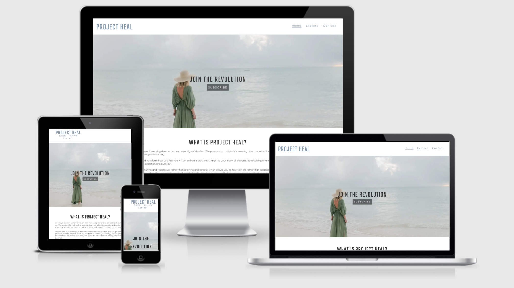
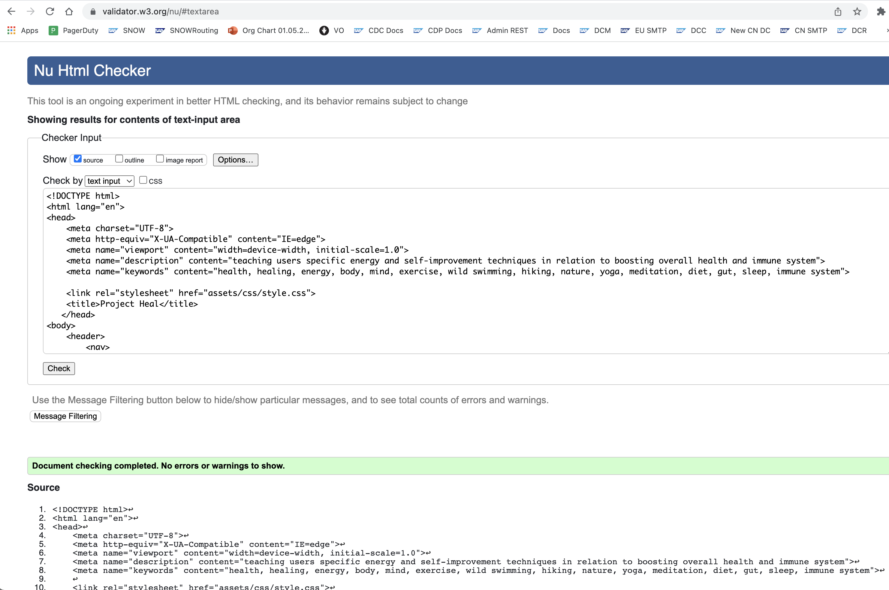
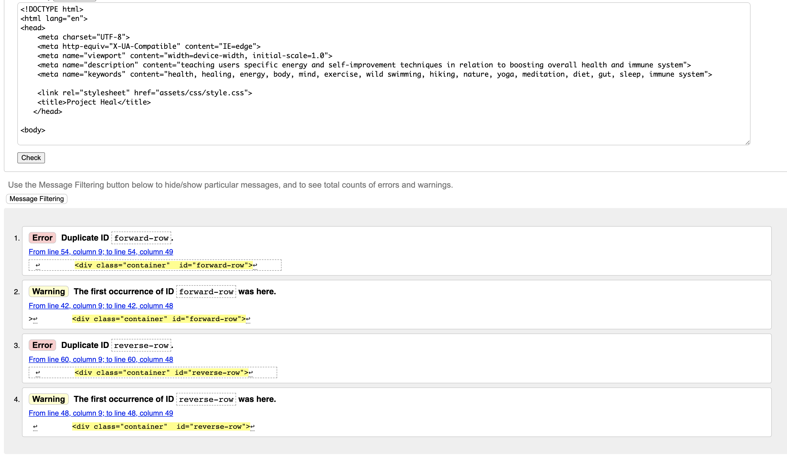
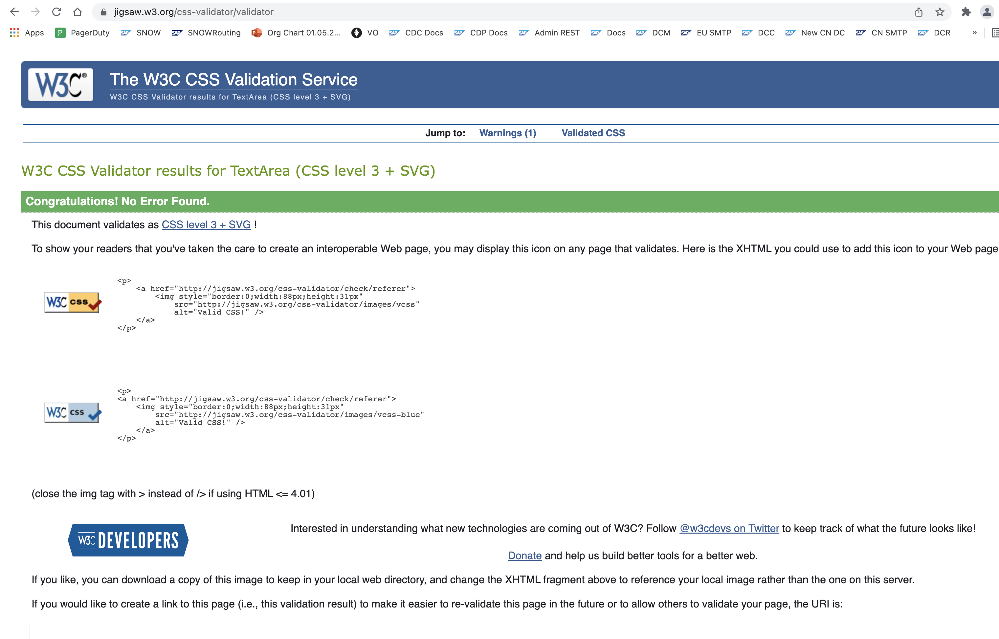
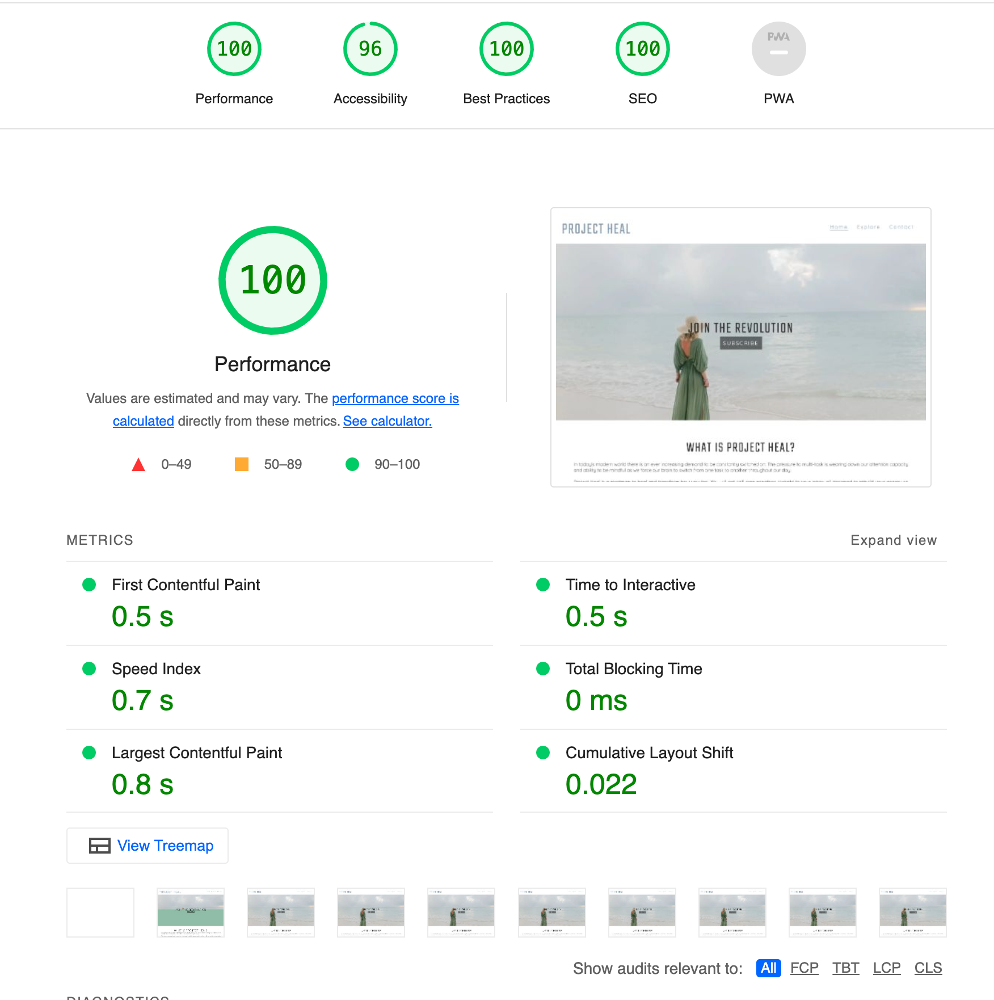
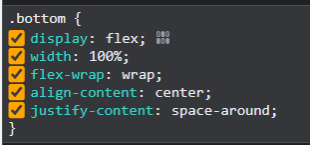

# **Project Heal**

CONTENTS

- Purpose
- Product

PURPOSE

The main focus of the site is educating users, enabling them to understand Project Heal&#39;s mission and allowing them to sign up to a newsletter for further guidance and latest news/events. Therefore this website is aimed at anyone who is looking to gain more insight into alternative/holistic healing and wishes to boost their mental and/or physical state, or indeed anyone looking to connect with like-minded individuals through local events.

PRODUCT

Offering users the ability to sign up for free holistic healing advice that is issued via newsletter which combines information on popular mind and body techniques with traditional spiritual wisdom and any local news/events that might interest or assist in the user journey. The website also helps users to understand the 4 main categories that can:

- create a shift in consciousness
- increase concentration and mindfulness
- assist in reconnecting with nature
- promote optimum health and happiness

Local events hosted by external parties that users can attend are listed on Meetup or Eventbrite and shared via the Project Heal&#39;s newsletter. Users can become a member by signing up to the Project Heal newsletter via the Contact Form on the Project Heal website.

Take a Look Here: [https://miriampayne.github.io/project-heal/](https://miriampayne.github.io/project-heal/)

**FINAL DESIGN**!

Images taken from: [http://ami.responsivedesign.is/](http://ami.responsivedesign.is/)

**INITIAL IDEA CONCEPT**

**WIREFRAMES**

Homepage Wireframe: [https://share.balsamiq.com/c/iVQGd9XuhAcpKYs74jEGpw.png](https://share.balsamiq.com/c/iVQGd9XuhAcpKYs74jEGpw.png)

Ethos Wireframe: [https://share.balsamiq.com/c/5G17myjCyHJp7apfmPxLPf.png](https://share.balsamiq.com/c/5G17myjCyHJp7apfmPxLPf.png)

Contact Wireframe: [https://share.balsamiq.com/c/fkkBXAXKKYudwGk7BzkQvo.png](https://share.balsamiq.com/c/fkkBXAXKKYudwGk7BzkQvo.png)

**UX/UI User Experience Design**

All Pages contain a Navigation menu at the top of the Webpage that directs the user to a new Page to allow users to Navigate the site easily. The Nav Menu is repositioned on a Mobile device to make use of space on smaller devices.

The Fonts used in this project are called &quot;Quicksand&quot; and &quot;Teko&quot; from Google Fonts with a back-up font of &quot;sans-serif&quot;.

**Business Goals**

Project Heal mission is to facilitate living a healthy and happy lifestyle and spread awareness of the ever increasing demands of modern society which are causing more individuals than ever before to seek self-help for issues that may be harmful in the long run if left untreated but are all too often put on a waitlist for support. We want to enable more people to take immediate action on their own health before preventable illnesses become yet another global crisis that mankind must face.

**Target Audience**

The target audience for this product is users looking for self improvement, anyone who may feeling drained or depleted from the daily grind.

**User Goals**

First Time Visitor Goals

- To easily understand the main purpose of the site
- To learn about the organisation.
- To intuitively navigate throughout the site.
- To be able to view the website and content clearly on any device, especially mobile.

Returning Visitor Goals

- To contact the organisation so they can request more information.
- To sign up to the newsletter
- To add new contact details

Frequent Visitor Goals

- To check to see if there is any new guidance
- To check if any additions to the site&#39;s features.
- To get alternative contact details for the organisation (email/phone)

**FEATURES**

**Existing Features**

- Nav Bar
- Hero Image
- About
- Links to Learn More
- Footer with links to social
- Responsive
- Explore page to learn more about our 4 Foundations of Health mentioned on the homepage
- Contact form including subscription checkbox

**Future Features**

- Login Feature
- A subscribe to newsletter feature on the main homepage
- A Training Resources Page
- E-commerce shop for purchasing courses
- Blog
- make email address point to the user&#39;s email app rather than the contact page

**TESTING**

As per the following guidelines: [https://www.guru99.com/web-application-testing.html](https://www.guru99.com/web-application-testing.html) I tested for the following:

Functionality:

- Checking for Syntax Errors
- Readable Color Schemas
- Standard Compliance.

Tested in incognito mode to avoid extensions impacting performance

Usability

Compatability: Firefox vs Chrome

Performance

Crowd - tested on family and work colleagues

The site has been tested against various screen sizes for a mobile-first responsive design and web pages have been Styled accordingly though the Explore page requires further work on responsiveness.

Validator Testing

Once testing was complete and i was more or less happy with the result i used validators W3C validator for HTML and Jigsaw Validator for CSS.

https://validator.w3.org/

[https://jigsaw.w3.org/css-validator/](https://jigsaw.w3.org/css-validator/)

All links to external websites open in a new browser tab. As this project is static and contains no back-end functionality at this time, the testing performed was on the visual effects and layout of the Website. Testing has been done on two main web browsers and all screen sizes down to 320px wide using the mobile simulator in Chrome Dev Tools.

All nav links direct to the correct html pages as per their names. The Home page is the exception, this one will redirect to index.html.

Use of the hover effect - all links show a difference in Color when you hover over the link.

Images are responsive on main page with their position changing in a visually pleasing manner, depending on breakpoints

Checked CSS Stylesheet correctly linkd to HTML but changing font-family

Tested color inheritence on body using color red for styling navigation menu items

Used Chrome Dev Tools to test various styles, especially for flex

**Validator Testing**

[https://validator.w3.org/](https://validator.w3.org/)

Main Page did not see any errors:

Whereas the Explore Page Requires some Fixes:

For CSS, I used the following Validator:

[https://jigsaw.w3.org/css-validator/](https://jigsaw.w3.org/css-validator/)

With no issues found like so:

**Lighthouse**

Tests were run on Lighthouse for both mobile and desktop with full marks apart from accessibility due to my contrast colours in the heading which I looked at fixing but decided in the end the visual presentation was better when the logo colour matches the nav bar colour.

**DEVICES**

I used a simulator in Chrome Dev Tools

**Chrome Developer Tools &amp; Responsive**

**ACCESSIBILITY**

Reaching 96% on Accessibility, I am keen to tinker around with colour contrast some more to meet 100% accessibility on Lighthouse. ARIA labels and alts were added to images.

**FIXED BUGS AND ERRORS**

Fixed hero image not loading issue with code from FreeCodeCamp: [https://www.freecodecamp.org/news/how-to-create-a-portfolio-website-using-html-css-javascript-and-bootstrap/](https://www.freecodecamp.org/news/how-to-create-a-portfolio-website-using-html-css-javascript-and-bootstrap/)

Zoom caused hero image to bleed over nav bar where overflow: hidden was not working due to some scoping, resolved with fixed height

Mitigated the issue of the foundations box containers not spacing correctly by using Chrome Dev Tools and checking which flex value works best.

My Font awesome account had an older version kit v5, the current version is v6 so the links weren&#39;t working for my kit and you only get one free per account so I needed to use &quot;fab fa-social &quot; instead of &quot;fa-brands fa-social&quot; in my html i classes. In hind-sight, I could have just created a new free Font Awesome account with a dummy email address but it was good to figure out a work-around. I used the &quot;How to Build Footer Section&quot; of this FreeCodeCamp page: [https://www.freecodecamp.org/news/how-to-create-a-portfolio-website-using-html-css-javascript-and-bootstrap/](https://www.freecodecamp.org/news/how-to-create-a-portfolio-website-using-html-css-javascript-and-bootstrap/) to work out the difference in the links.

I later realised there&#39;s actually a drop-down filter that should be selected in the icon search field of the Font Awesome Website: [https://fontawesome.com/](https://fontawesome.com/)

Changed active page underline border to sit closer to the anchor element by removing it from the li class .push and adding a .active class to the anchor element of the active page

Got nav menu to sit centre under logo with Flexbox / media queries

**UNRESOLVED BUGS OR ERRORS**

Responsiveness on Explore page

Nav looks a little off center on mobile device

Between 927 and 1200 need to fix spacing between items inside each top/bottom div maybe put some more divs inside those divs

Need media query at 1200 x 1080

CSS does not allow words in foundations box containers to centre-align

Had lots of issues trying to get the zig-zag effect on the Explore page so a lot of the issues remaining and many of the responsive issues is both a time and knowledge restriction as i am yet to learn javascript and more to add the features I would like, for example a hamburger menu for the nav bar on mobile devices.

I would have liked to have spent a bit more time on responsiveness but I have run out of time so will save fixing those issue for post deployment

**FUNCTIONALITY**

**TECHNOLOGIES USED**

**PROGRAMS USED**

**DEPLOYMENT**

**Creating My Website**

**Git Hub Pages**

**Forking a repo**

**Cloning a repo**

**REMOTE DEPLOYMENT:**

**HOW TO FORK A REPOSITORY:**

**HOW TO CLONE A REPOSITORY:**

**HOW TO MAKE A LOCAL CLONE**

**CREDITS AND REFERENCES**

Pexels: [https://www.pexels.com/collections/project-heal-g5fbejw/](https://www.pexels.com/collections/project-heal-g5fbejw/)

**IMAGES AND INFORMATION**

Content

Inspiration:

DailyOm https://www.dailyom.com/

Stress, Concentration and Attention Span in today&#39;s busy society:

[https://www.theguardian.com/science/2022/jan/02/attention-span-focus-screens-apps-smartphones-social-media](https://www.theguardian.com/science/2022/jan/02/attention-span-focus-screens-apps-smartphones-social-media)

[https://hbr.org/2007/10/manage-your-energy-not-your-time](https://hbr.org/2007/10/manage-your-energy-not-your-time)

Declan O&#39;Donoghue on the power of Thoughts: [https://youtu.be/y971cJiHYRc](https://youtu.be/y971cJiHYRc)

Pillars of health ideas:

[https://sweetrusticbakes.com/four-pillars-health-wellness/](https://sweetrusticbakes.com/four-pillars-health-wellness/)

[https://www.lyliarose.com/blog/read\_190485/the-restored-health-quiz-can-improve-sleep-nutrition-movement-and-mindset.html](https://www.lyliarose.com/blog/read_190485/the-restored-health-quiz-can-improve-sleep-nutrition-movement-and-mindset.html)

Media

Images

[https://www.freecodecamp.org/news/how-to-create-a-portfolio-website-using-html-css-javascript-and-bootstrap/](https://www.freecodecamp.org/news/how-to-create-a-portfolio-website-using-html-css-javascript-and-bootstrap/)

Pexels: [https://www.pexels.com/collections/project-heal-g5fbejw/](https://www.pexels.com/collections/project-heal-g5fbejw/)

[Font Awesome](https://fontawesome.com/icons/leaf?style=solid)

**CODE**

_Flexbox tutorials_

[_https://css-tricks.com/snippets/css/a-guide-to-flexbox/_](https://css-tricks.com/snippets/css/a-guide-to-flexbox/)

[_https://daily-dev-tips.com/posts/chrome-devtools-flex-debugger/_](https://daily-dev-tips.com/posts/chrome-devtools-flex-debugger/)

Tip from [@seán\_ci](https://code-institute-room.slack.com/team/U023BDTRM9C) on slack community: How to easily create a Navigation Menu with Flexbox

_Code to fix Hero Image issue: https://www.freecodecamp.org/news/how-to-create-a-portfolio-website-using-html-css-javascript-and-bootstrap/_

_Responsive Design Media Queries tutorials_

_For the Explore page I actually used Testimonials:_ [_https://www.w3schools.com/howto/howto\_css\_testimonials.asp_](https://www.w3schools.com/howto/howto_css_testimonials.asp) _and used flexbox to get the zig-zag/reverse effect._

Google Fonts [https://fonts.google.com/](https://fonts.google.com/)

**Tools**

Balsamiq Wireframes - [https://balsamiq.cloud/](https://balsamiq.cloud/)

HTML - W3C Validator Validating my HTML

CSS - Jigsaw Validator Validating my CSS

Chrome Lighthouse and Chrome Developer Tools - to check website performance

Gitpod - Dev Environment using GIT to commit changes to Github

Github - GithHub is the hosting site used to store the source code for the Website and Git Pages is used for the deployment of the live site.

Am I Responsive used to test responsiveness of the website at different screen sizes: [http://ami.responsivedesign.is/](http://ami.responsivedesign.is/)

I first used the MacBook to resize images to KB and then proceeded to upload the downsized images to Convertio [https://convertio.co/](https://convertio.co/) which was used to convert jpg image files to webp files as per the Google Chrome Dev Tools Lighthouse feature&#39;s recommendations on performance optimisation

**ACKNOWLEDGEMENTS:**

- I&#39;d like to thank my mentor Ben Kavanagh for his unparalleled guidance, patience and support throughout my project: [https://github.com/BAK2K3](https://github.com/BAK2K3)
- David Bowers, 5p Lead, for taking time out of work to jump on both informal calls and also webinars on CSS positioning and flexbox: [https://github.com/dnlbowers](https://github.com/dnlbowers)
- Tip from @seán\_ci on slack community: How to easily create a Navigation Menu with Flexbox
- Tutors on the course, especially Ed who who helped with caching issues
- Family, work colleagues and friends for their support, encouragement and patience whilst I battle the time management to juggle everything.
- Fellow community members on CI Slack workspace for sharing issues, hints, tips and advice
- README Inspirations: Love Running [https://github.com/Code-Institute-Solutions/readme-template](https://github.com/Code-Institute-Solutions/readme-template) [https://github.com/TechCentreUK/Eco-Print](https://github.com/TechCentreUK/Eco-Print) [https://github.com/Chr15w1986/Portfolio-1](https://github.com/Chr15w1986/Portfolio-1)
